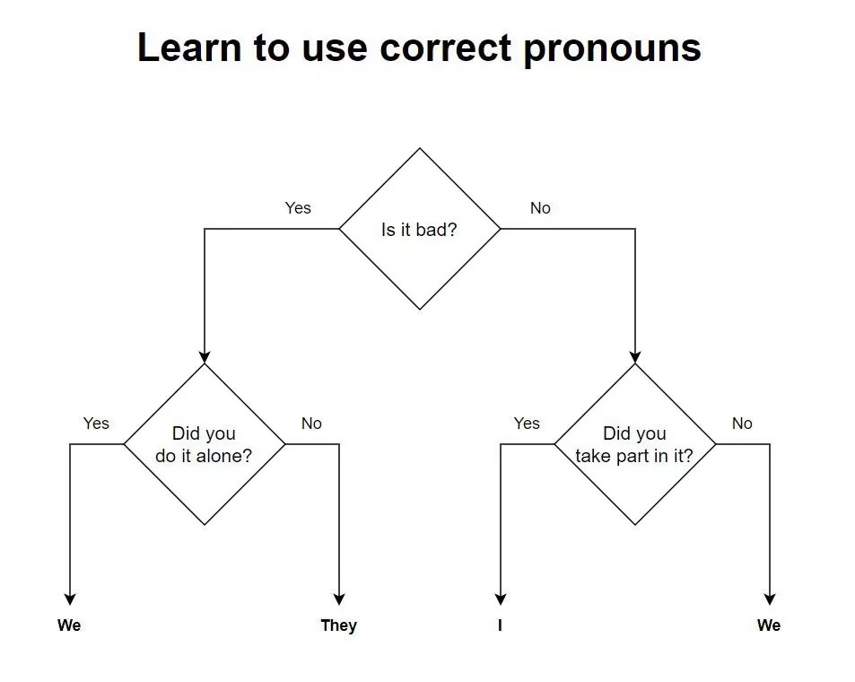

好消息是互联网上有很智者，说过很多颇有智慧的话，或多或少对我的思想和眼界产生了影响。坏消息是互联网是脆弱的，以超链接构筑的世界因为种种原因在快速的消亡，再也找不到。做个记录吧，智慧值得留下。

## tombkeeper集

### 1. 老师傅和打工人

粉丝群里有人问 35 岁危机的问题。其实我以前多次以“老师傅和老工人”的例子讲过。

同一批招进厂的工人，十几二十年后，有些人会成为老师傅，其余的那些只能成为老工人。就算你不想当车间主任，但是不是可以成为老师傅？

你工作了五年或者十年，现在月薪两万。你的价值可以用两个月薪一万的人代替吗？如果能，那你就是老工人。老师傅的价值是无法用几个新工人代替的。

那怎么成为老师傅呢？你可以仔细想一想：你以及你的同行身上，哪些属性可以创造价值？这些属性里，哪些会随着年龄增长而增加？哪些会随着年龄增长而衰退？如何有意识地增强那些会随着年龄增长而增加的属性？你的同行前辈里，成为了老师傅的人，他们有哪些共性？你是不是可以制定计划去提升自己的那些方面？

当然，进行以上这些思考的前提是别犟，不能有“我就是我，我为什么要学别人”的想法。无论是练武还是练字，都得先学别人，然后才可能自成一派。等你成了老师傅，可以再考虑自立门户。

### 2. 学会做事

中国每年大概有五百万理工科毕业生。其中堪称优秀技术人才的自然是少数。然而，技术好又会做事的更是极少数。

什么是“做事”？就是确立目标、分析路径、规划资源、制定方案、迭代执行。优秀技术人才，自然是能把技术做好的人。但从做技术到做事，中间还有很远的距离。大部分人可能终其一生都不会做事。

前阵子一个同学跟我说想去 BlackHat 演讲。我说你是怎么规划这件事的？他一愣，半天说不出话。他定了目标，但没去想后面的事情。

然后我问他有没有注意到 BlackHat 有些演讲水平很高，但也有一些不太行的。他说确实是这样。然后我说你有没有分析过为什么会这样？他说没有。我说如果你分析一下那些不太行的演讲为什么也能上 BlackHat，是不是会对你达成目标有帮助？他恍然大悟。

我说这只是一个小点，还不算完。你知道怎么才能上 BlackHat？他想了一下说是投稿被接受。我说那么是不是应该收集既往演讲的内容摘要，分析被接受的投稿有什么特点。

然后我说你有没有想过 Blackhat 演讲者和主办方之间是什么关系？他说不知道。我说本质是商业合作关系。主办方给演讲者提供曝光机会和机票酒店，演讲者用自己的内容帮主办方把票卖出去。所以投稿要让别人看了觉得是有利于卖票的。

我又问你有没有想过 Review Board 里的人是怎么挑选演讲的？有没有想过如果你在  Review Board 你会看重哪些？有没有了解过 Review Board 里的那些人？其中和你技术方向相关的人有哪些？这些人历史上做过什么？他们可能会对哪些东西更青睐？

说了这么多，还只是分析路径这一步。后面规划资源、制定方案、迭代执行都还需要更多的思考。当然，这个同学刚毕业，不会做事很正常，后面还有时间慢慢学。但如果你毕业已经很久了，发现自己还不会做事，就要开始留心培养这方面的能力了。在学校里我们的成长主要靠学习知识。毕业后，更重要的成长是学会做事。

### 3. 谁花？谁赚？

很多问题大家吵吵闹闹说不到点子上。对任何事情，都可以按下面这个思路想一想：

这个事情涉及钱吗？
如果涉及钱，谁花钱？谁赚钱？
从掏钱的角度看：花了钱有什么收益？花钱是被迫的还是主动的？
从赚钱的角度看：这钱你想赚也能赚吗？或者还有别人能赚这个钱吗？怎么才能赚到这个钱？ ​​​

### 4. 让时间慢下来

时间知觉和年龄的问题有很多相关研究。主要还是因为年龄越大，每天接触的东西就越重复。所以，如果不希望感觉时间飞快流逝，就要开放心态，积极接触和学习新事物。对旧事物也要积极挖掘以前没有关注的细节。

## 杂集
### 1. 少操心 by 方三文
问：
方丈，您好。投资的事，请教您不多，但是关于人的那些事却频频向您请教，非常感谢，在您这里学习到颇多的人生智慧。
方丈，请教您，家族内部、亲戚之间处好关系，及处理好相关事务，有哪些原则和技巧，能否分享经验和心得吗? 突然发现自己在处理这些关系的时候社恐了，压力感倍增，有些“怕”，有“想逃离”的感觉。

答：
尽量少麻烦别人。 少操心别人的事，更不要居高临下地指导、评价别人。 有意愿、能力
可以主动帮助别人，但不要求任何回报。

### 2. 草台班子理论 by 天青色的西风

我工作以后才发现，大家都是草台班子。政府草台，企业草台，我也草台，大家都草台，凑合赚钱过日子。一个企业，看着像一台奔驰在高速公路上的豪华轿车，里面其实是几个人蹬着自行车顶个壳。路上的车都是这样，大家谁都不戳破。

### 3. Learn to use correct pronouns

### 4. 产品思维转变为问题思维

1. 产品思维：有一个想法 —> 构建一个产品 —> 去找适配的用户和场景
2. 问题思维：找到一个场景 —> 发现一个问题 —> 提供解决方案

用户购买的动机不是产品本身，而是能够解决他们的问题的结果

如何发现问题：

1. 从工作流种找。我们所处的行业、职能不同，会有不同的工作流，也就是说会有不同的问题等待解决。结束一天工作后，我们可以回顾一下，在今天的工作中，遇到了哪些问题和阻碍？在过往和现在的工作中，有没有一些问题反复出现？

2. 除了工作，我们的生活也是在不断解决问题。
3. 从已经商业化的产品中找问题。观察现有商业产品要解决的问题和目标群体

### 5. Embrace the grind

We’re an industry obsessed with automation, with streamlining, with efficiency. One of the foundational texts of our engineering culture, Larry Wall’s [virtues of the programmer](https://web.archive.org/web/20210311050133/https://www.threevirtues.com/), includes laziness:

> **Laziness**: The quality that makes you go to great effort to reduce overall energy expenditure. It makes you write labor-saving programs that other people will find useful and document what you wrote so you don’t have to answer so many questions about it.

I don’t disagree: being able to offload repetitive tasks to a program is one of the best things about knowing how to code. However, sometimes problems can’t be solved by automation. If you’re willing to embrace the grind you’ll look like a magician.

> https://jacobian.org/2021/apr/7/embrace-the-grind/

### 6. 媒体与转发

媒体与传播-朋友圈转发背后的心理学

- 转发首先是一种表达。分享的核心是那某某，表达的核心是我。分享是那某某说了啥，表达是我跟你说啊，那某某说了啥
- 大众往往趋向于转发那些表达了他们特有情绪的内容，内容传播需要满足目标群体的心理特征，让其看完后感觉“卧槽，这就是再说我呀”
- 大众往往趋向于转发那些让下级受众对自己产生所需要印象（Zhuang Bi）的内容或者大众往往趋向于转发那些让自己产生智力优越感的内容。

### 7. 没苦硬吃的心理学分析 by 有个梨
很多人活得辛苦是因为吃苦是最容易的决策而且没有任何道德包袱，说到底好生活只给勇敢和没多少道德束缚的人留着。

注：有可能吃苦的决策还很无效，没啥实际作用，导致吃苦螺旋 😀
